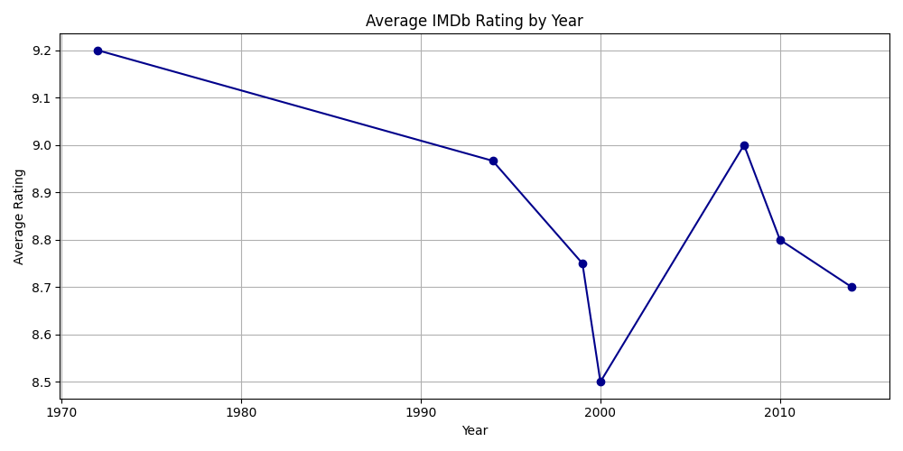
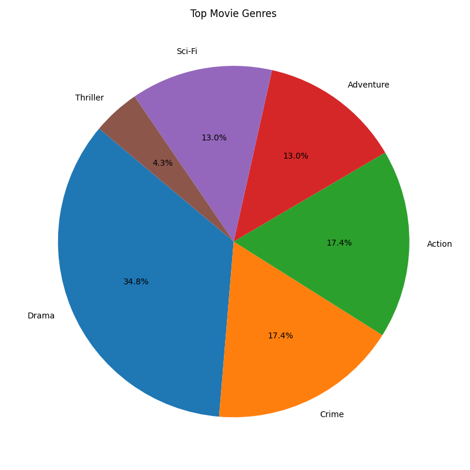

# 🎬 Movie Ratings Tracker

A Python project that fetches and analyzes IMDb movie ratings using the free OMDb API. This tool pulls data about popular films, analyzes patterns like top-rated movies and most common genres, and generates clean visualizations with `matplotlib`.

---

## 🔧 Features

- 🎯 Fetch IMDb movie details via the OMDb API
- 📊 Analyze:
  - Top N rated movies
  - Average IMDb rating
  - Movies grouped by year or director
  - Most common genres
- 📈 Visualizations:
  - Bar charts (ratings, years, directors)
  - Pie chart (genres)
  - Line plot (rating trends over time)

---

## 🧠 Skills Demonstrated

- Python programming
- API integration (`requests`)
- Data analysis with `pandas`
- Data visualization with `matplotlib`
- Modular code structure
- Git/GitHub workflow

---
## 🎯 Movie Ratings Tracker Visualizations

### 📊 Top 5 Movies by Rating


### 🍿 Genre Distribution



##  How to Run

### 1. Install dependencies
```bash
pip install requests pandas matplotlib
